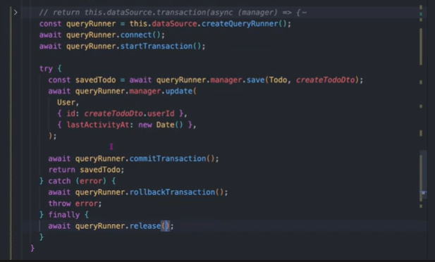
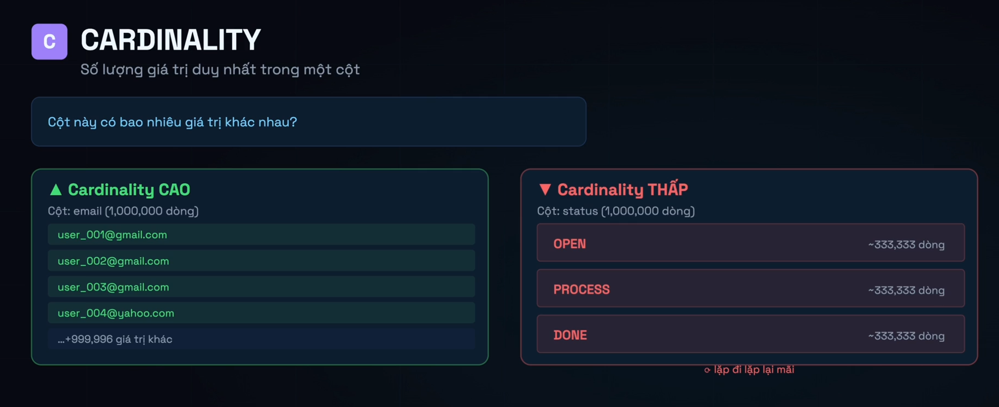
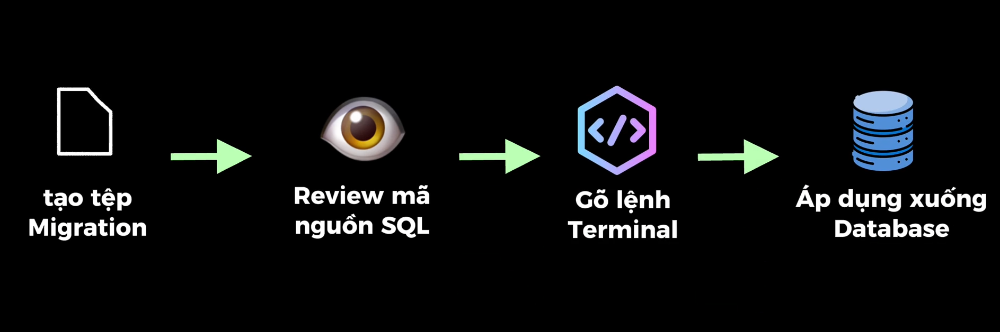
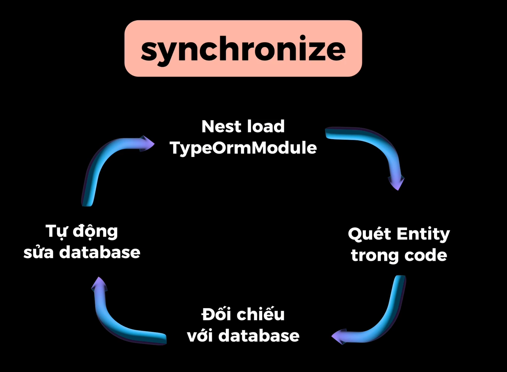

// decorator
// có thể dùng decorator @Res để điều khiển response trả về,
// nhưng sẽ mất đi tính năng tự động serialize của NestJS,
// nên không khuyến khích sử dụng @Res trong trường hợp này

CHECK VALIDITY:

- Định nghĩa DTO (Data Transfer Object) để validate dữ liệu đầu vào cho các endpoint.
- Thêm các class-validator để validate dữ liệu đầu vào.
- Bật validationPipe trong main.ts để thự thi luật cho tất cả các route.

* PIPE:
  DTO: data transfer object, đối tượng truyền dữ liệu, dùng để validate dữ liệu đầu vào cho các endpoint.

Entity: đối tượng đại diện cho một bảng trong db, có thể gọi là model, schema(mongoose)

- CLI:
  nest g module todos
  nest g co todos --no-spec
  nest g s todos --no-spec
  nest g repository todos --no-spec --flat
  --flat: tạo file trong thư mục hiện tại, không tạo thêm thư mục con.

  nest g class todos/dto/create-todo.dto --no-spec
  nest g resource categories --no-spec

- LB:
  - npm add class-transformer class-validator
    class-transformer: chuyển đổi dữ liệu đầu vào thành instance của class DTO, giúp class-validator có thể validate được.
    class-validator: validate dữ liệu đầu vào dựa trên các decorator được định nghĩa trong class DTO.
  - npm add @nestjs/mapped-types

- whitelist: chỉ cho phép các thuộc tính được định nghĩa trong class DTO được truyền vào, nếu có thuộc tính nào không được định nghĩa sẽ bị loại bỏ, giúp bảo vệ ứng dụng khỏi các dữ liệu không mong muốn.
- forbidNonWhitelisted: nếu có thuộc tính nào không được định nghĩa trong class DTO được truyền vào, sẽ trả về lỗi, giúp bảo vệ ứng dụng khỏi các dữ liệu không mong muốn.
- enableImplicitConversion: tự động chuyển đổi kiểu dữ liệu đầu vào tự động thành kiểu dữ liệu được định nghĩa trong class DTO, giúp giảm thiểu lỗi do kiểu dữ liệu không đúng.

https://docs.nestjs.com/pipes#built-in-pipes

---

Inversion of Control (IoC): là một nguyên tắc trong lập trình mà trong đó, việc tạo và quản lý các đối tượng được chuyển giao cho một framework hoặc container, thay vì do chính ứng dụng tự quản lý.

dependency injection (DI): là một kỹ thuật trong lập trình để giảm sự phụ thuộc giữa các thành phần của ứng dụng, giúp tăng tính linh hoạt và dễ bảo trì của mã nguồn.
ví dụ: trong NestJS, chúng ta có thể sử dụng DI để inject một service vào một controller, giúp controller có thể sử dụng các phương thức của service mà không cần phải tự tạo instance của service đó.

cách hoạt động

cách sử dụng:

@Injectable(): là một decorator trong NestJS được sử dụng để đánh dấu một class là một provider, cho phép nó được inject vào các thành phần khác của ứng dụng thông qua cơ chế dependency injection (DI). Khi một class được đánh dấu bằng @Injectable(), NestJS sẽ tự động quản lý vòng đời của instance của class đó và cung cấp nó cho các thành phần khác khi cần thiết.

đăng ký class trong module:

- providers: là một mảng chứa các provider (các class được đánh dấu bằng @Injectable()) mà module sẽ quản lý và cung cấp cho các thành phần khác của ứng dụng thông qua cơ chế dependency injection (DI). Khi một class được đăng ký trong providers, NestJS sẽ tự động tạo instance của class đó và cung cấp nó cho các thành phần khác khi cần thiết.
- import: là một mảng chứa các module khác mà module hiện tại phụ thuộc vào. Khi một module được import vào một module khác, tất cả các provider và controller của module đó sẽ được cung cấp cho module hiện tại thông qua cơ chế dependency injection (DI). Điều này cho phép các thành phần của module hiện tại có thể sử dụng các provider và controller của module được import mà không cần phải tự tạo instance của chúng.

instance: là một đối tượng được tạo ra từ một class, chứa các thuộc tính và phương thức của class đó. Trong NestJS, khi một class được đánh dấu bằng @Injectable() và được đăng ký trong providers của một module, NestJS sẽ tự động tạo instance của class đó và cung cấp nó cho các thành phần khác của ứng dụng thông qua cơ chế dependency injection (DI). Instance này sẽ được quản lý vòng đời bởi NestJS, có nghĩa là nó sẽ được tạo ra khi cần thiết và bị hủy khi không còn sử dụng nữa.

module architecture: là một cách tổ chức mã nguồn trong NestJS, trong đó các thành phần của ứng dụng được chia thành các module riêng biệt, mỗi module có trách nhiệm quản lý một phần cụ thể của ứng dụng. Mỗi module có thể chứa các controller, service, provider và các thành phần khác liên quan đến chức năng của module đó. Module architecture giúp tăng tính modularity và dễ bảo trì của mã nguồn, cho phép các nhà phát triển dễ dàng quản lý và mở rộng ứng dụng theo từng phần cụ thể.

- Encapsulation, imports, exports:
  khi muốn sử dụng service của module khác thì phải export service đó trong module chứa service đó, sau đó import nguyên module vào module muốn sử dụng service đó.
  Encapsulation ở cấp module có nghĩa là các thành phần của module chỉ có thể sử dụng các thành phần được export bởi module đó, không thể truy cập trực tiếp vào các thành phần khác của module. Điều này giúp bảo vệ tính toàn vẹn của module và giảm sự phụ thuộc giữa các module, giúp tăng tính modularity và dễ bảo trì của mã nguồn.
  VÍ DỤ: khi 1 module A có nhiều service, nhưng chỉ muốn export 1 service để các module khác sử dụng, thì chỉ cần export service đó trong module A, các service còn lại sẽ không được export và không thể truy cập trực tiếp từ các module khác.

# ERROR HANDLING:

- BadRequestException: bad request status code 400 client gửi dữ liệu không hợp lệ
- UnauthorizedException: unauthorized status code 401 lỗi do client không có quyền truy cập
- ForbiddenException: forbidden status code 403 lỗi do client đã đăng nhập nhưng không có quyền truy cập vào tài nguyên
- NotFoundException: not found status code 404 lỗi do tài nguyên không tồn tại
- ConflictException: conflict status code 409 lỗi do xung đột dữ liệu, ví dụ khi tạo một tài khoản (username/email) đã tồn tại
- InternalServerErrorException: internal server error status code 500 lỗi do server

# ================== DATABASE ====================

# ORM: Object-ralational mapping/ Anh xạ quan hệ đối tượng

ORM là một lớp trung gian giữa ứng dụng và cơ sở dữ liệu, giúp chuyển đổi dữ liệu giữa các đối tượng trong ứng dụng và các bảng trong cơ sở dữ liệu. ORM cung cấp một cách tiếp cận hướng đối tượng để làm việc với cơ sở dữ liệu, giúp giảm sự phức tạp của việc viết SQL thủ công và tăng tính linh hoạt của mã nguồn.

# Lợi ích:

- code ngắn gọn hơn, dễ đọc hơn
- type safety (an toàn về kiểu): giúp phát hiện lỗi về kiểu dữ liệu sớm hơn trong quá trình phát triển
- dễ bảo trì khi schema thay đổi. khi thay đổi schema, chỉ cần thay đổi entity, không cần phải thay đổi toàn bộ code liên quan đến database
- quản lý hệ giữa các bảng dễ hàng hơn ví dụ: one-to-many, many-to-many, one-to-one chỉ cần định nghĩa trong entity, không cần phải viết SQL thủ công để quản lý mối quan hệ giữa các bảng ORM sẽ tự lo phần join tự lồng object đây là phần mạnh nhất của ORM
- bảo mật hơn khi sử dụng ORM, chúng ta không cần phải viết SQL thủ công, giúp giảm nguy cơ bị tấn công SQL injection
  ví dụ OR 1=1 để bypass authentication, nhưng khi sử dụng ORM, chúng ta sẽ không viết SQL thủ công, giúp giảm nguy cơ bị tấn công SQL injection
- repository pattern: ORM cung cấp sẵn các phương thức find, create, update, delete,... chỉ cần inject vào và dùng
- không bị khóa chặt vào 1 database cụ thể

# Các ORM phổ biến:

- TypeORM: là một ORM phổ biến trong cộng đồng Node.js, hỗ trợ nhiều loại
- Prisma: là một ORM mới nổi, được đánh giá cao về hiệu suất và tính năng, hỗ trợ nhiều loại database, có một công cụ CLI mạnh mẽ giúp quản lý schema và migration dễ dàng hơn.
- Drizzle ORM: là một ORM mới nổi, được đánh giá cao về hiệu suất và tính năng, hỗ trợ nhiều loại database, có một công cụ CLI mạnh mẽ giúp quản lý schema và migration dễ dàng hơn.

# TypeORM sẽ phù hợp với nestjs vì có nhiều điểm tương đồng về patten.

# ORM sẽ giúp code backend của bạn trở nên sạch sẽ hơn, dễ đọc hơn, dễ bảo trì hơn, giúp bạn tập trung vào logic nghiệp vụ thay vì phải lo lắng về việc viết SQL thủ công và quản lý kết nối đến database. ORM cũng giúp tăng tính bảo mật cho ứng dụng của bạn bằng cách giảm nguy cơ bị tấn công SQL injection.

- - 

# TypeORM CLI:

npm add @nestjs/typeorm typeorm pg @nestjs/config
=> lệnh để cài đặt TypeORM, driver cho PostgreSQL và module config của NestJS để quản lý biến môi trường.

# Docker

CLI:

- `docker compose up -d`: chạy docker compose ở chế độ detached, tức là chạy ở background, không hiển thị log trên terminal
- `docker ps`: hiển thị danh sách các container đang chạy

# RELATIONSHIP entity note ở trong enity todo

# Cascade: "đổ dồn" hoặc thác nước ám chỉ 1 hành động kéo theo nhiều hành động khác

có 3 chế độ cascade: 

- TH1: khi user bị xóa thì tất cả các todo của user đó cũng bị xóa theo vì todo là dữ liệu riêng của từng user => cascade: ['remove']
- TH2: category với todo có mối quan hệ nhiều-một, khi category bị xóa thì nên sử dụng đặt trạng thái categoryId của todo thành null để tránh mất dữ liệu todo => cascade: ['setnull']
  =>Kết luận nếu mối quan hệ giữa 2 bảng là:
- one-to-many hoặc one-to-one thì nên sử dụng cascade: ['remove'] để khi xóa một bản ghi thì các bản ghi liên quan cũng bị xóa theo
- many-to-one hoặc many-to-many thì nên sử dụng cascade: ['setnull'] để khi xóa một bản ghi thì các bản ghi liên quan sẽ không bị xóa mà chỉ bị đặt trạng thái null để tránh mất dữ liệu liên quan

onDelete: 'CASCADE' hoặc 'SET NULL' là xử lý lúc xóa dữ liệu

cascade: true có tác dụng khi dùng TypeORM có liên quan đến lúc tạo hoặc update data
ví dụ: khi tạo todo mới có đưa object user vào thì nó tự động tạo user mới nếu user đó chưa tồn tại, nhưng nếu chỉ đưa userId vào thì nó sẽ không tự động tạo user mới mà sẽ liên kết với user đã tồn tại có id tương ứng, nên cascade: true sẽ không có tác dụng trong trường hợp này vì chúng ta không đưa object user vào mà chỉ đưa userId vào để liên kết với user đã tồn tại.

LƯU Ý: khi sử dụng cascade
ví dụ quan hệ của user và đơn hàng trong 1 trang bán hàng khi user bị xóa thì đơn hàng của user đó ko nên xóa theo vì dữ liệu đơn hàng cần giữ lại để phục vụ cho việc thống kê, kiểm toán, bóa cáo,... Trong trường hợp này nên chọn cách giữ lại dữ liệu hoặc đánh dấu đã xóa (soft delete)

# TRANSACTION:

Cách 1:
import { DataSource } from 'typeorm';
và khởi tạo trong constructor: private dataSource: DataSource
`private readonly dataSource: DataSource, // sử dụng transaction của TypeORM`

khi sử dụng transaction thì sẽ logic sẽ như bình thường nhưng sẽ thay đổi ở return

Cách 2: với những trường hợp phức tạp hơn: sử dụng query runner để quản lý transaction, cách này sẽ linh hoạt hơn cách 1 nhưng sẽ phức tạp hơn vì phải quản lý transaction thủ công, phải commit hoặc rollback transaction thủ công, phải release query runner thủ công,... nên chỉ nên sử dụng cách này khi có những logic phức tạp mà cách 1 không thể đáp ứng được.
lưu ý: lưu ý ko được quên release query runner sau khi sử dụng xong để tránh bị rò rỉ kết nối đến database, nếu quên release sẽ dẫn đến việc hết kết nối đến database
 viết thủ công transaction với query runner
 có sử lí logic phức tạp hơn

Cách 3: decorator @Transaction() của TypeORM
CLI: `npm add typeorm-transactional`
cách này để hiểu hơn thôi thực tế ko nên dùng vì là library bên thứ 3

# RECAP TRANSACTION:

transaction ko phải free khi mở transaction thì db sẽ phải giữ khóa của các dòng dữ liệu đang sữa hoặc đọc được thả ra khi transaction này kết thúc (khi commit hoặc rollback)
Nguyên tắc 1:

- khi sử dụng transaction thì phải giữ càng ít thời gian càng tốt, chỉ nên mở transaction khi cần thiết và đóng transaction ngay khi xong việc để tránh bị khóa dữ liệu quá lâu dẫn đến hiệu suất kém hoặc deadlock
- chỉ bọc các thao tác database thực sự cần đi chung với nhau, đừng gọi API hay xử lý nặng trong transaction khi ko cần thiết

-- Nguyên tắc 2:
Không phải lúc nào cũng cần transaction, chỉ dùng khi có từ 2 thao tác trở lên đi cùng nhau và cần đảm bảo tính toàn vẹn dữ liệu, nếu chỉ có 1 thao tác thì không cần transaction vì nó đã là một đơn vị nguyên tử rồi, không cần phải bọc thêm transaction nữa.

Nguyên tắc 3: transaction ko giải quyết vấn đề race condition
 ví dụ 2 tài khoản cùng chuyển tiền cho 1 tài khảo thứ 3 thì kết quả cuối cùng tài khoản thứ 3 chỉ nhận được 1 khoản tiền thay vì 2 khoản tiền vì transaction chỉ đảm bảo tính toàn vẹn dữ liệu trong một đơn vị công việc, nhưng không giải quyết được vấn đề race condition khi có nhiều đơn vị công việc cùng truy cập và sửa đổi dữ liệu cùng lúc,
=> để giải quyết vấn đề này thì cần sử dụng isolation level hoặc locking để kiểm soát chặt hơn

# Tối ưu truy vấn với index:

- khi truy vấn ko theo index thì db phải thực hiện full table scan để tìm kiếm dữ liệu, điều này sẽ rất chậm khi bảng có nhiều dữ liệu
- index giúp db có thể tìm kiếm dữ liệu nhanh hơn bằng cách sử dụng cấu trúc dữ liệu đặc biệt để lưu trữ và truy xuất dữ liệu, giúp tăng hiệu suất truy vấn đáng kể, đặc biệt là khi bảng có nhiều dữ liệu
- tuy nhiên, index cũng có nhược điểm là chiếm thêm dung lượng lưu trữ
- mỗi lần insert, update, delete dữ liệu thì db cũng phải cập nhật index tương ứng tốn thêm ít thời gian ghi nhưng số lần ghi thường ít hơn số lần đọc nên vẫn nên sử dụng index để tối ưu truy vấn

Khi nào nên tạo index vào cột:

- THêm index vào các mệnh đề WHERE, JOIN, ORDER BY, GROUP BY thường xuyên sử dụng trong truy vấn để tăng hiệu suất truy vấn
- sử dung decorator @Index() của TypeORM để tạo index cho cột trong entity
- @Index(['userId', 'title']) // composite index (index tổ hợp) chỉ hoạt động khi truy vấn có cả userId và title
- @Index(['categoryId']) // index cho cột categoryId
- những primary key mặc định đã có index rồi nên không cần tạo index cho cột id nữa
- những column có tính duy nhất (unique) cũng đã có index rồi nên không cần tạo index cho cột đó nữa
- ko nên tạo index cho các cột enum/ boolean vì thường có ít giá trị khác nhau nên index sẽ không hiệu quả, thậm chí còn làm chậm truy vấn hơn do phải duy trì index cho các giá trị đó

Câu lệnh query để kiểm tra xem db có sử dụng index hay không:
`EXPLAIN ANALYZE SELECT * FROM todos WHERE userId = 1;` 

- SELECTIVITY & CARDINALITY:
  - selectivity: bộ chọn lọc là tỷ lệ phần trăm sau khi lọc dữ liệu, selectivity cao có nghĩa là bộ lọc quá ghắt sau khi lọc dữ liệu thì còn lại ít bản ghi, selectivity thấp có nghĩa là bộ lọc quá lỏng sau khi lọc dữ liệu thì còn lại nhiều bản ghi
  - cardinality: số lượng giá trị duy nhất trong một cột nghĩa là cột này có bao nhiêu giá trị khác nhau, cardinality cao có nghĩa là cột này có nhiều giá trị khác nhau, cardinality thấp có nghĩa là cột này có ít giá trị khác nhau 
    => CỘT CÓ CARDINALITY CAO -> SELECTIVITY CAO -> INDEX HIỆU QUẢ
    => CỘT CÓ CARDINALITY THẤP -> SELECTIVITY THẤP
    => QUY TẮC VÀNG: NÊN TẠO INDEX CHO CÁC CỘT CÓ CARDINALITY CAO
- Tối ưu truy vấn index với những cột có bộ chọn lọc thấp
- CÁCH 1: sử dụng composite index ví dụ với status là enum có 3 giá trị khác nhau thì cardinality thấp, nhưng nếu kết hợp với cột userId có nhiều giá trị khác nhau thì cardinality sẽ cao hơn, giúp index hiệu quả hơn
- CÁCH 2: sử dụng partial index (index một phần) chỉ index cho là sử dụng @Index() truyển vào option where để chỉ index cho những bản ghi có status là 'active' ví dụ như sau:
  @Index('idx_active_status', { where: "status = 'active'" })
  status: string;
  => khi truy vấn với điều kiện status = 'active' thì db sẽ sử dụng index này để tối ưu truy vấn, còn khi truy vấn với điều kiện status khác 'active' thì db sẽ không sử dụng index này vì index này chỉ áp dụng cho những bản ghi có status là 'active' nên sẽ không hiệu quả nếu truy vấn với điều kiện khác 'active'
  => KẾT LUẬN: NÊN SỬ DỤNG COMPOSITE INDEX HOẶC PARTIAL INDEX CHO NHỮNG CỘT CÓ CARDINALITY THẤP ĐỂ TỐI ƯU TRUY VẤN
  KẾT LUẬN VỀ INDEX: 

# MIGRATION:

CLI: npm add -D dotenv

SYNCHURONIZE: 

LƯU Ý KHI SỬ DỤNG MIGRATION: khi đã run migration rồi thì không nên thay đổi trực tiếp trong entity nữa mà phải tạo migration mới để thay đổi schema của database, nếu thay đổi trực tiếp trong entity mà không tạo migration mới thì sẽ dẫn đến việc schema của database không đồng bộ với entity, gây lỗi khi chạy ứng dụng hoặc khi deploy ứng dụng lên production vì schema của database không đúng với entity nên sẽ không thể truy vấn dữ liệu đúng cách
