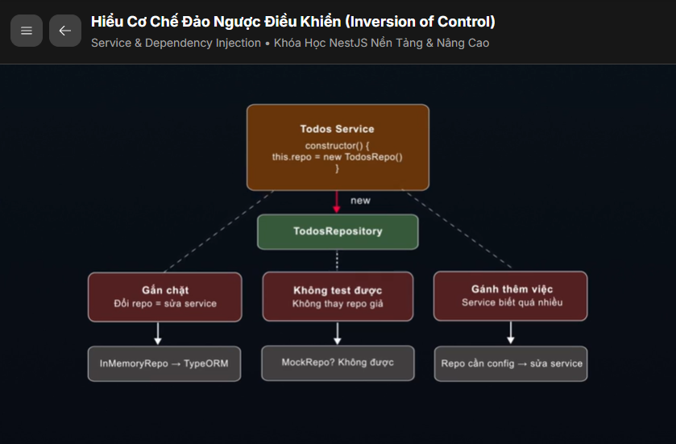
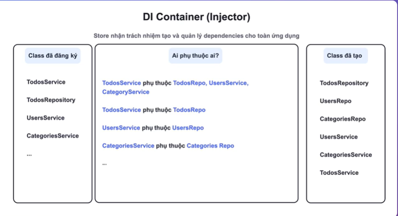
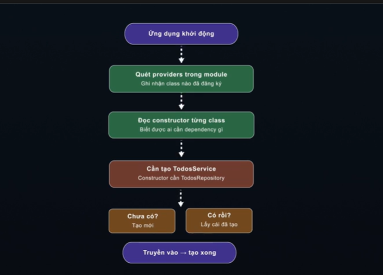
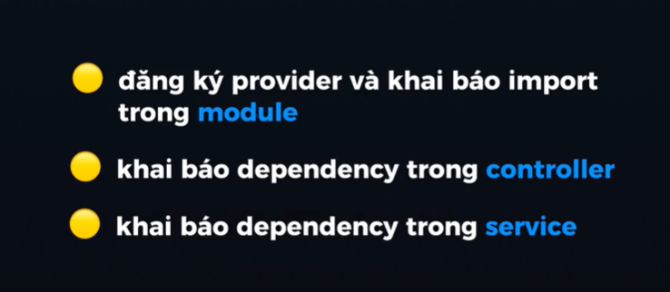
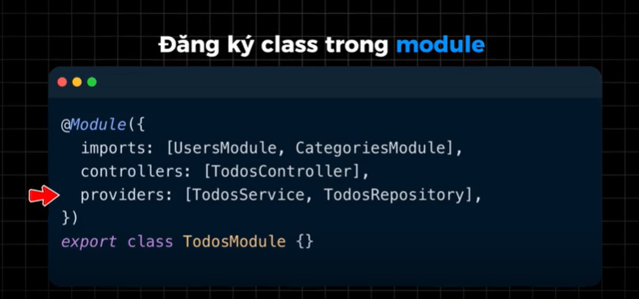

// decorator
// có thể dùng decorator @Res để điều khiển response trả về,
// nhưng sẽ mất đi tính năng tự động serialize của NestJS,
// nên không khuyến khích sử dụng @Res trong trường hợp này

CHECK VALIDITY:

- Định nghĩa DTO (Data Transfer Object) để validate dữ liệu đầu vào cho các endpoint.
- Thêm các class-validator để validate dữ liệu đầu vào.
- Bật validationPipe trong main.ts để thự thi luật cho tất cả các route.

* PIPE:
  DTO: data transfer object, đối tượng truyền dữ liệu, dùng để validate dữ liệu đầu vào cho các endpoint.

Entity: đối tượng đại diện cho một bảng trong db, có thể gọi là model, schema(mongoose)

- CLI:
  nest g class todos/dto/create-todo.dto --no-spec

- LB:
  - npm add class-transformer class-validator
    class-transformer: chuyển đổi dữ liệu đầu vào thành instance của class DTO, giúp class-validator có thể validate được.
    class-validator: validate dữ liệu đầu vào dựa trên các decorator được định nghĩa trong class DTO.
  - npm add @nestjs/mapped-types

- whitelist: chỉ cho phép các thuộc tính được định nghĩa trong class DTO được truyền vào, nếu có thuộc tính nào không được định nghĩa sẽ bị loại bỏ, giúp bảo vệ ứng dụng khỏi các dữ liệu không mong muốn.
- forbidNonWhitelisted: nếu có thuộc tính nào không được định nghĩa trong class DTO được truyền vào, sẽ trả về lỗi, giúp bảo vệ ứng dụng khỏi các dữ liệu không mong muốn.
- enableImplicitConversion: tự động chuyển đổi kiểu dữ liệu đầu vào tự động thành kiểu dữ liệu được định nghĩa trong class DTO, giúp giảm thiểu lỗi do kiểu dữ liệu không đúng.

https://docs.nestjs.com/pipes#built-in-pipes

---

Inversion of Control (IoC): là một nguyên tắc trong lập trình mà trong đó, việc tạo và quản lý các đối tượng được chuyển giao cho một framework hoặc container, thay vì do chính ứng dụng tự quản lý.

dependency injection (DI): là một kỹ thuật trong lập trình để giảm sự phụ thuộc giữa các thành phần của ứng dụng, giúp tăng tính linh hoạt và dễ bảo trì của mã nguồn.
ví dụ: trong NestJS, chúng ta có thể sử dụng DI để inject một service vào một controller, giúp controller có thể sử dụng các phương thức của service mà không cần phải tự tạo instance của service đó.

cách hoạt động

cách sử dụng:

@Injectable(): là một decorator trong NestJS được sử dụng để đánh dấu một class là một provider, cho phép nó được inject vào các thành phần khác của ứng dụng thông qua cơ chế dependency injection (DI). Khi một class được đánh dấu bằng @Injectable(), NestJS sẽ tự động quản lý vòng đời của instance của class đó và cung cấp nó cho các thành phần khác khi cần thiết.

đăng ký class trong module:

- providers: là một mảng chứa các provider (các class được đánh dấu bằng @Injectable()) mà module sẽ quản lý và cung cấp cho các thành phần khác của ứng dụng thông qua cơ chế dependency injection (DI). Khi một class được đăng ký trong providers, NestJS sẽ tự động tạo instance của class đó và cung cấp nó cho các thành phần khác khi cần thiết.
- import: là một mảng chứa các module khác mà module hiện tại phụ thuộc vào. Khi một module được import vào một module khác, tất cả các provider và controller của module đó sẽ được cung cấp cho module hiện tại thông qua cơ chế dependency injection (DI). Điều này cho phép các thành phần của module hiện tại có thể sử dụng các provider và controller của module được import mà không cần phải tự tạo instance của chúng.

instance: là một đối tượng được tạo ra từ một class, chứa các thuộc tính và phương thức của class đó. Trong NestJS, khi một class được đánh dấu bằng @Injectable() và được đăng ký trong providers của một module, NestJS sẽ tự động tạo instance của class đó và cung cấp nó cho các thành phần khác của ứng dụng thông qua cơ chế dependency injection (DI). Instance này sẽ được quản lý vòng đời bởi NestJS, có nghĩa là nó sẽ được tạo ra khi cần thiết và bị hủy khi không còn sử dụng nữa.
